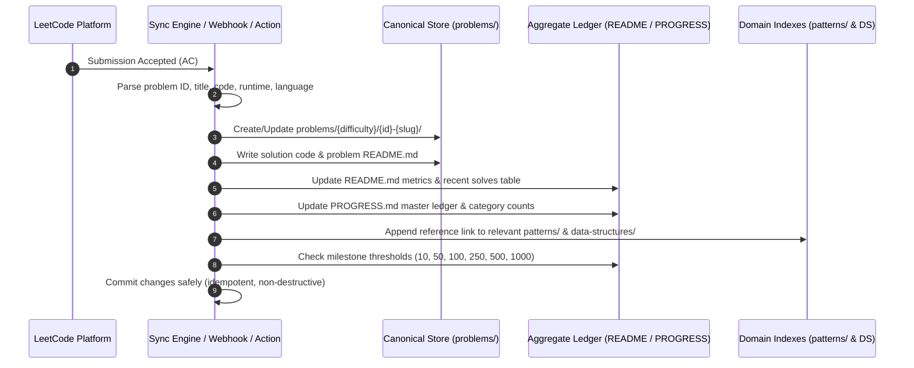

# 🤖 LeetCode → GitHub Automation Specification

This document defines the architectural specification, data flow, directory conventions, and update mechanisms for the automated LeetCode synchronization pipeline.

---

## 🏛️ 1. Core Architecture & Storage Philosophy

The repository enforces a **Single Source of Truth (SSOT)** model to avoid redundant copies of code:

```text
                                  ┌───────────────────────────────┐
                                  │      LeetCode Submission      │
                                  └───────────────┬───────────────┘
                                                  │
                                                  ▼
                                ┌───────────────────────────────────┐
                                │     Canonical Solution Store      │
                                │   problems/{easy,medium,hard}/    │
                                └─────────┬───────────────┬─────────┘
                                          │               │
                 ┌────────────────────────┼───────────────┼────────────────────────┐
                 ▼                        ▼               ▼                        ▼
       ┌──────────────────┐     ┌──────────────────┐  ┌──────────────┐    ┌─────────────────┐
       │     README.md    │     │   PROGRESS.md    │  │  patterns/   │    │ data-structures/│
       │ (Metrics/Recent) │     │ (Master Ledger)  │  │   (Guides)   │    │    (Guides)     │
       └──────────────────┘     └──────────────────┘  └──────────────┘    └─────────────────┘
```

### Directory Roles

| Directory | Role | Solution Code Permitted? | Description |
| :--- | :--- | :---: | :--- |
| `problems/easy/`<br>`problems/medium/`<br>`problems/hard/` | **Canonical Store** | **YES (Sole Location)** | Holds problem directories containing raw source code (`solution.py`, `solution.cpp`, etc.) and the problem's dedicated `README.md`. |
| `patterns/` | **Pattern Guides & Index** | **NO** | Deep-dive guides, invariant blueprints, and indexed links to canonical solutions. |
| `data-structures/` | **Data Structure Guides & Index**| **NO** | Core implementations, complexity references, and indexed links to canonical solutions. |
| `algorithms/` | **Algorithm Guides & Index** | **NO** | Algorithm domain summaries (Sorting, DP, Greedy, Graph) and topic indexes. |
| `daily/` | **Chronological Logs** | **NO** | Yearly/monthly challenge calendars and daily practice references. |

---

## 📁 2. Canonical Problem Directory Structure

Every solved problem is stored under its respective difficulty tier with a normalized, 4-digit zero-padded folder naming convention:

```text
problems/
└── medium/
    └── 0003-longest-substring-without-repeating-characters/
        ├── README.md         # Problem writeup, metadata, and intuition analysis
        ├── solution.py       # Primary implementation
        └── solution.cpp      # (Optional) Secondary language implementation
```

### Canonical Problem `README.md` Template

Each problem's `README.md` contains a machine-readable YAML/HTML frontmatter block followed by manual/automated writeup sections:

```markdown
<!--
id: 3
title: "Longest Substring Without Repeating Characters"
difficulty: "Medium"
url: "https://leetcode.com/problems/longest-substring-without-repeating-characters/"
languages: ["Python", "C++"]
primary_pattern: "Sliding Window"
data_structures: ["Hash Table", "String"]
algorithms: ["Two Pointers"]
time_complexity: "O(N)"
space_complexity: "O(min(N, M))"
date_solved: "2026-08-28"
status: "Mastered"
-->

# 3. Longest Substring Without Repeating Characters

- **Difficulty**: Medium
- **URL**: [LeetCode #3](https://leetcode.com/problems/longest-substring-without-repeating-characters/)
- **Patterns**: Sliding Window, Hash Table
- **Time Complexity**: $O(N)$
- **Space Complexity**: $O(\min(N, M))$

<!-- AUTOMATION_PROBLEM_BODY_START -->
## Problem Statement
[Problem description text and constraints]
<!-- AUTOMATION_PROBLEM_BODY_END -->

## 💡 Engineering Intuition & Invariant
[Manual explanation of the invariant, why the sliding window works, and how duplicate indices are skipped]

## 🧪 Complexity Analysis
- **Time**: $O(N)$ because the right pointer traverses the string once and left pointer moves monotonically.
- **Space**: $O(\min(N, M))$ where $M$ is alphabet charset size.
```

---

## 🔄 3. End-to-End Submission Data Flow

When a problem is submitted on LeetCode, the automated pipeline follows these sequential stages:



---

## ⚙️ 4. Pipeline Capability Specifications

### 1. Ingestion & Problem Detection
- Ingest accepted submissions via a dedicated sync engine (e.g. Custom GitHub Action, sync webhook, or browser-assisted integration).
- Extract problem ID, slug, title, difficulty (`Easy`, `Medium`, `Hard`), submission runtime, memory, code, and language.

### 2. Canonical Directory Resolution
- Determine target directory based on difficulty: `problems/<difficulty>/<0000-slug>/`.
- Sanitize slug to lowercase alphanumeric kebab-case.

### 3. Source Code Ingestion
- Save code with standard extensions (`solution.py`, `solution.cpp`, `solution.java`, `solution.go`, `solution.ts`, `solution.rs`).
- If an existing solution in the same language exists, update only if the new submission has superior runtime/memory or marks a refactor.

### 4. Problem Writeup & Metadata Generation
- Generate problem `README.md` containing frontmatter metadata.
- Pre-populate problem statement inside `<!-- AUTOMATION_PROBLEM_BODY_* -->` tags.
- Maintain a dedicated manual section (`## 💡 Engineering Intuition`) that the pipeline **never overwrites** on subsequent syncs.

### 5. Aggregate Statistics Recalculation
- Parse all problem metadata across `problems/{easy,medium,hard}/`.
- Calculate:
  - Total solved count
  - Difficulty distribution ($E / M / H$)
  - Language distribution percentages
  - Progress bar block updates (`░░░░░░░░░░`)
- Update `README.md` between `<!-- AUTOMATION_METRICS_START -->` and `<!-- AUTOMATION_METRICS_END -->`.

### 6. Recent Solves Stream Update
- Maintain the 5 to 10 most recent solves sorted by `date_solved` descending.
- Update `README.md` between `<!-- AUTOMATION_RECENT_SOLVES_START -->` and `<!-- AUTOMATION_RECENT_SOLVES_END -->`.

### 7. Category & Topic Progress Calculation
- Update category counts and percentages in `PROGRESS.md`.
- Append entry to the master problem log in `PROGRESS.md` between `<!-- AUTOMATION_PROBLEM_LOG_START -->` and `<!-- AUTOMATION_PROBLEM_LOG_END -->`.

### 8. Pattern & Data Structure Guide Indexing
- If a problem specifies `primary_pattern: "Sliding Window"`, ensure a reference link exists in `patterns/sliding-window/README.md`.
- No duplicate code files are created in the pattern directory.

### 9. Milestone Evaluation
- Evaluate solved count against milestones:
  - $10, 50, 100, 250, 500, 1000$.
- Automatically toggle `[ ]` to `[x]` in `README.md` when thresholds are crossed.

### 10. Non-Destructive Update Guarantee
- All automated edits **MUST** only replace text bounded by explicit delimiter comments.
- User-written markdown notes, deep-dive explanations, custom diagrams, and learning entries outside these delimiters are preserved untouched.

---

## 🔒 5. Automation Delimiters Contract

The automation pipeline adheres strictly to the following delimiter conventions:

```text
README.md:
  ├── <!-- AUTOMATION_METRICS_START --> ... <!-- AUTOMATION_METRICS_END -->
  └── <!-- AUTOMATION_RECENT_SOLVES_START --> ... <!-- AUTOMATION_RECENT_SOLVES_END -->

PROGRESS.md:
  └── <!-- AUTOMATION_PROBLEM_LOG_START --> ... <!-- AUTOMATION_PROBLEM_LOG_END -->

problems/<difficulty>/<id>-<slug>/README.md:
  └── <!-- AUTOMATION_PROBLEM_BODY_START --> ... <!-- AUTOMATION_PROBLEM_BODY_END -->
```

---

## ⚠️ 6. Key Decisions & Architectural Considerations

Before deploying the live automation engine, the following decisions should be finalized:

1. **Sync Ingestion Mechanism**:
   - *Option A (Direct LeetHub extension)*: Tends to write solutions directly to root or fixed folders; requires custom post-processing to conform to our `problems/<difficulty>/<0000-slug>/` structure.
   - *Option B (Custom GitHub Action / Cron Sync)*: Fetches accepted submissions directly via LeetCode GraphQL API on a schedule or manual trigger, providing full control over directory placement and metadata parsing. *(Recommended)*
   - *Option C (CLI Sync Tool)*: A local Python/TypeScript CLI tool run after practice sessions that pulls recent solves and updates the laboratory locally before pushing.

2. **Pattern & Data Structure Classification**:
   - LeetCode's default tags are often broad (e.g. tagging almost everything as "Array").
   - The pipeline can provide default tags extracted from LeetCode, but allow manual overrides in the problem's metadata frontmatter that persist across syncs.

3. **Multi-Language Strategy**:
   - Multiple language solutions for the same problem will reside side-by-side in the same canonical folder (`solution.py`, `solution.cpp`, `solution.rs`), keeping discussions and complexity notes unified in a single `README.md`.
